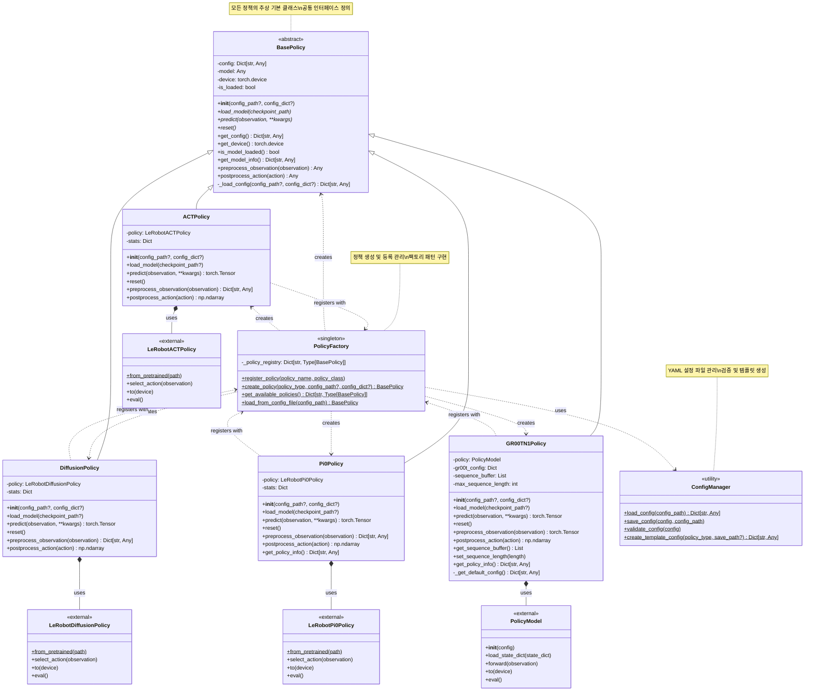

# Unified Policy Framework - Class Diagram

## 클래스 관계 설명

### 🏗️ 상속 구조
- **BasePolicy** (추상 클래스): 모든 정책의 공통 인터페이스
- **구체 정책들**: ACTPolicy, DiffusionPolicy, Pi0Policy, GR00TN1Policy

### 🔧 주요 패턴
- **Factory Pattern**: PolicyFactory가 정책 생성 담당
- **Strategy Pattern**: BasePolicy 인터페이스로 정책 교체 가능
- **Template Method**: BasePolicy의 공통 메서드들

### 📦 의존성
- **Internal**: 각 정책은 해당하는 외부 라이브러리 모델을 포함
- **External**: LeRobot 및 GR00T 라이브러리의 실제 모델들
- **Configuration**: ConfigManager가 YAML 설정 관리

### 🔄 등록 시스템
- 각 정책 클래스는 모듈 로드시 PolicyFactory에 자동 등록
- 런타임에 새로운 정책 타입 추가 가능
